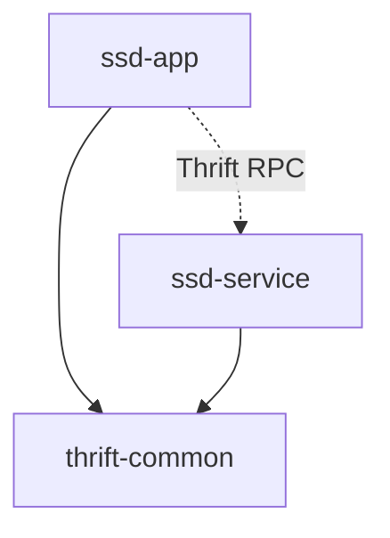

# XIMA SSD 解耦架构说明

## 项目架构概览

经过重构，现在的项目采用了完全解耦的微服务架构，包含三个独立的模块：

```
ximaSSD/
├── thrift-common/          # Thrift通用模块
├── ssd-service/           # 业务服务模块  
├── ssd-app/               # Web应用模块
└── pom.xml               # 父项目配置
```

## 模块详细说明

### 1. thrift-common（Thrift通用模块）
**职责**：提供Thrift IDL定义和通用工具类

**包含内容**：
- `src/main/thrift/user_service.thrift` - Thrift IDL定义文件
- `src/main/java/com/ximalaya/ssd/thrift/` - 自动生成的Thrift代码
- `src/main/java/com/ximalaya/thrift/client/` - Thrift客户端工厂类

**特点**：
- 独立的Maven模块，可被其他项目引用
- 包含所有Thrift相关的通用代码
- 提供连接池管理功能

### 2. ssd-service（业务服务模块）
**职责**：专门处理业务逻辑，提供Thrift服务实现

**包含内容**：
- `SSDServiceApplication.java` - Spring Boot启动类
- `UserServiceImpl.java` - 用户服务业务逻辑实现
- `ThriftServer.java` - Thrift服务器管理
- `application.yml` - 服务配置

**运行端口**：
- Spring Boot Web: 8081（健康检查）
- Thrift服务: 9090

**特点**：
- 完全独立的微服务
- 只关注业务逻辑处理
- 提供Thrift RPC接口

### 3. ssd-app（Web应用模块）
**职责**：纯粹的客户端应用，通过REST API对外提供服务

**包含内容**：
- `SSDApplication.java` - Spring Boot启动类
- `UserController.java` - REST API控制器
- `application.yml` - 应用配置

**运行端口**：
- Spring Boot Web: 8080

**特点**：
- 纯客户端应用
- 通过Thrift RPC调用后端服务
- 对外提供RESTful API

## 依赖关系



- `ssd-app` 依赖 `thrift-common`（获取客户端工具）
- `ssd-service` 依赖 `thrift-common`（获取服务接口定义）
- `ssd-app` 通过Thrift RPC调用 `ssd-service`

## 运行方式

### 启动顺序

1. **启动 ssd-service（业务服务）**
```bash
cd ssd-service
mvn spring-boot:run
```

2. **启动 ssd-app（Web应用）**
```bash
cd ssd-app  
mvn spring-boot:run
```

### 验证服务

1. **检查ssd-service健康状态**
```bash
curl http://localhost:8081/actuator/health
```

2. **通过ssd-app测试完整链路**
```bash
# 测试连接
curl http://localhost:8080/api/users/ping

# 获取用户列表
curl http://localhost:8080/api/users

# 获取特定用户
curl http://localhost:8080/api/users/1
```

## 架构优势

### 1. 完全解耦
- 每个模块都可以独立开发、测试、部署
- `ssd-app` 和 `ssd-service` 没有直接依赖关系
- 通过Thrift协议进行通信，支持跨语言

### 2. 职责清晰
- `thrift-common`: 协议定义和通用工具
- `ssd-service`: 专注业务逻辑处理
- `ssd-app`: 专注用户界面和API网关功能

### 3. 可扩展性强
- 可以轻松添加新的服务模块
- 可以部署多个 `ssd-service` 实例实现负载均衡
- 可以创建不同类型的客户端（Web、移动端等）

### 4. 技术栈灵活
- 服务端可以使用不同的技术栈（只要支持Thrift）
- 客户端可以根据需要选择合适的技术
- 数据库和中间件可以独立选择

## 开发工作流

### 1. 修改接口定义
1. 修改 `thrift-common/src/main/thrift/user_service.thrift`
2. 重新生成代码：`thrift --gen java -out src/main/java src/main/thrift/user_service.thrift`
3. 发布新版本的 `thrift-common`

### 2. 开发业务逻辑
1. 在 `ssd-service` 中实现新的业务逻辑
2. 更新 `UserServiceImpl.java`
3. 独立测试和部署

### 3. 开发客户端功能
1. 在 `ssd-app` 中添加新的REST接口
2. 调用 `ssd-service` 的Thrift接口
3. 独立测试和部署

## 部署建议

### 开发环境
- 本地同时启动所有服务
- 使用默认端口配置

### 生产环境
- 使用Docker容器化部署
- 配置服务发现（如Consul、Eureka）
- 添加负载均衡（如Nginx、HAProxy）
- 配置监控和日志收集

### 配置管理
- 使用配置中心（如Spring Cloud Config）
- 环境变量覆盖配置文件
- 敏感信息使用密钥管理系统

## 下一步改进

1. **服务发现**：集成Consul或Eureka
2. **负载均衡**：支持多实例部署
3. **监控告警**：集成Prometheus + Grafana
4. **链路追踪**：集成Zipkin或Jaeger
5. **容器化**：提供Docker镜像和K8s部署文件
6. **安全认证**：添加JWT或OAuth2支持 